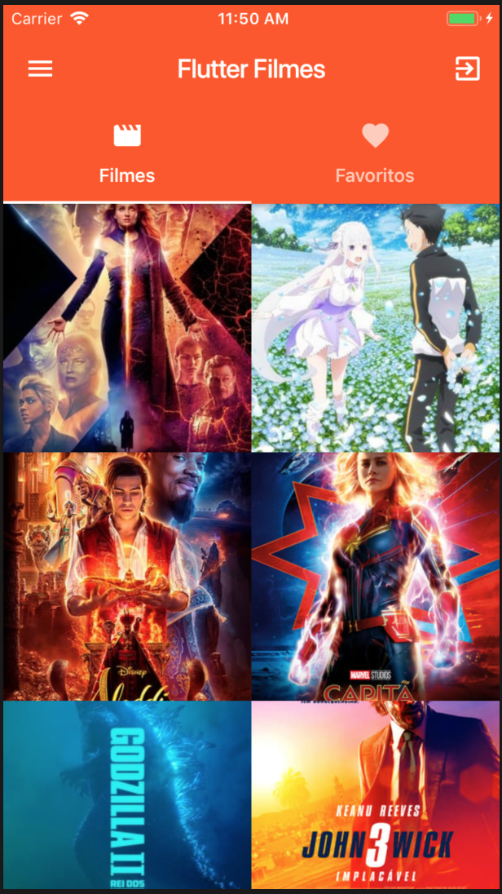
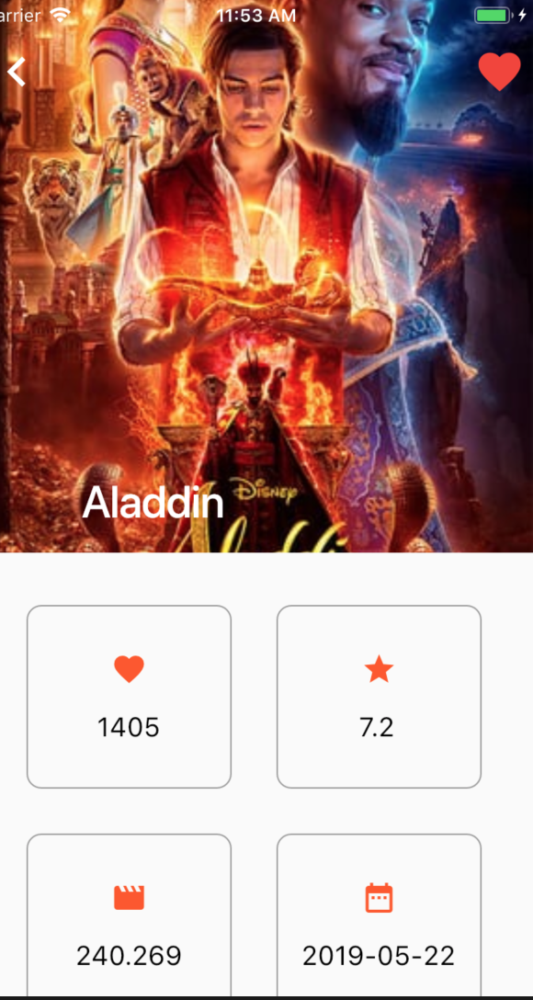

# movies_flutter_2019
App simples de lista de filmes feita com Flutter (aula 1 e aula 2).

## Projeto utiliza:

* Flutter
* Flare: https://www.2dimensions.com/a/funwithflutter/files/flare/heart/preview

* Na branch 'master' está o projeto com o ícone do favorito (coração) normal.
* Na branch 'flare' está o ícone com a animação do coração. Para o Flare funcionar utilizar o channel "dev" do flutter. Abrir o terminal e digitar este comando: "flutter channel dev"

## prints

